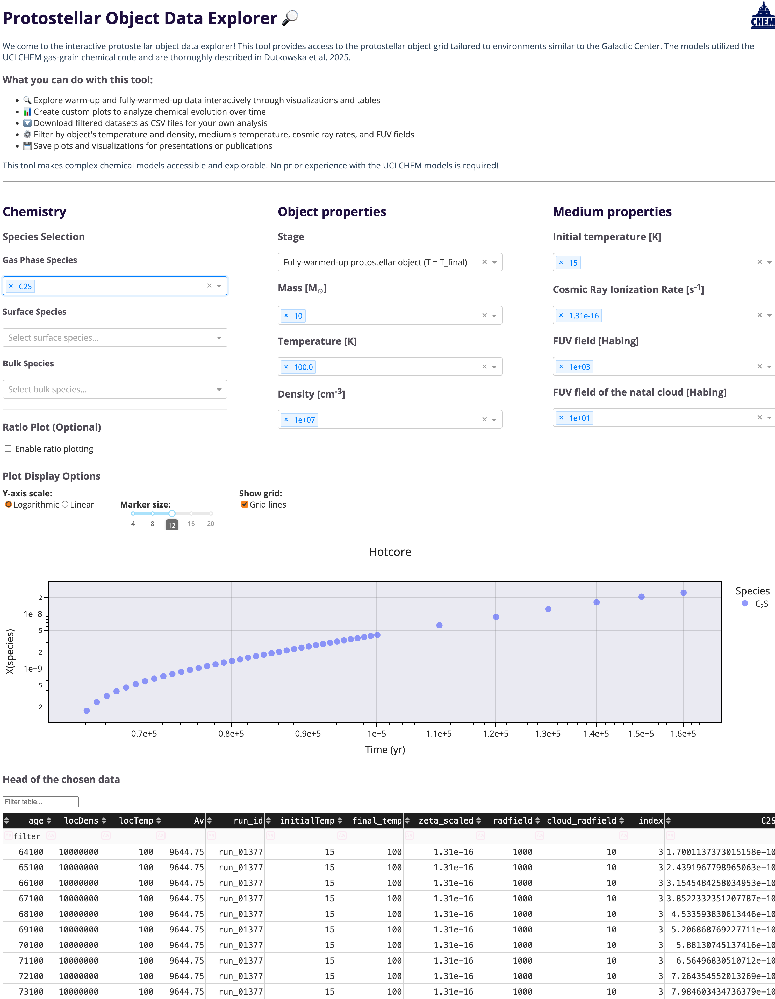

# CMZ Data Explorer

A lightweight Dash app for interactively exploring astrochemical model outputs ([UCLCHEM](https://github.com/uclchem) Holdship+2017, Vermariën+in prep.) from protostellar objects and shocks. Designed for the Milky Way's Central Molecular Zone-like conditions, this app makes it easy to inspect species abundances and physical parameters across a model grid.

---

## 🚀 Features

- Interactive visualizations of protostellar object and shock models  
- Flexible filtering by parameters like temperature, density, cosmic ray ionization rate (`zeta`), and more  
- Built-in formatting for complex molecule names  
- Supports custom UCLCHEM grids in HDF5 format 

---

## 📦 Getting Started

### 1. Clone the Repository or Download the Zip of the Repository

Here's how to clone:

```bash
git clone https://github.com/YOUR_USERNAME/CMZ-data-explorer.git
cd CMZ-data-explorer
```
Alternatively, just download the zip through the **Code** button on the top of the repository, like so: 


### 2. Define Your Paths

Once you have all the files you need, edit `config.py` and replace all instances of `/absolute/path/to` with the full paths to your local files. You will need to set:

- Pickle files (REQUIRED):

```python
hotcore_pkl = "/absolute/path/to/hotcore.pkl"
cshock_pkl  = "/absolute/path/to/cshock.pkl"
```

- Grid file (OPTIONAL **if** you have pickle files already):

```python
grid_name = 'your_grid_name.h5'
grid_path = f"/absolute/path/to/{grid_name}"
```

### 3. Set Up the Environment

I recommend using [conda](https://docs.conda.io/projects/conda/en/latest/user-guide/install/index.html) to deal with apps like this one. Replace `YOUR_ENV_NAME` with your preferred environment name (e.g., `cmz_app`). Please, **DO NOT FORGET** to *activate* your conda environment before installing anything (see below).
```bash
conda create -n YOUR_ENV_NAME python=3.12
conda activate YOUR_ENV_NAME  
pip install dash
pip install pandas
```

### 4. Launch the App

Once everything is configured move to the folder where the codes are located:
```
cd codes
```
and then activate the app you need:
```
python Shocks.py
```
or 
```
python Protostellar_objets.py
```
The app will be available via a browser at `http://127.0.0.1:8050/` by default, but `http://localhost:8050/` should also work reliably.  
To stop the app, press `CTRL+C` in the terminal where it's running.  

When you're done working with the app, you can deactivate the environment with:
`conda deactivate`

Below is an example of the app in use when one species is plotted:


---

## 📁 Project Structure

```
codes/
├── assets/ 
│   ├── custom_style.css        # Dash styling
│   ├── Zip-file.png            # An image used in README.md
│   ├── Working-app.png         # An image used in README.md 
│   └── uclchem_transparent.png # UCLCHEM's logo
├── Protostellar_objets.py  # Dash app for protostellar object models
├── Shocks.py               # Dash app for shock models
├── config.py               # All paths and global constants
├── environment.yml         # Conda environment spec
├── data_extraction.py      # Parses raw HDF5 grid data
└── functionality.py        # Core model processing and molecule formatting

```
---

## ⚠️ Notes

- You must have access to the full grid file (HDF5 format) and/or the preprocessed `.pkl` files. These are not included in the repository. The full grid is available via [Zenodo](https://doi.org/10.5281/zenodo.1567494) and was described in [Dutkowska+2025](https://ui.adsabs.harvard.edu/abs/2025arXiv250810759D/abstract). For .pkl files contact me directly: dutkowska **at** strw.leidenuniv.nl
- If you need to regenerate `.pkl` files, make sure `grid_path` is correctly set.
- Supported UCLCHEM models: **hotcore**, **cshock**

---

## 📚 Acknowledgments

If you use this tool for your research, please consider citing the underlying chemical modeling work, to respect the work put into creating it.

---

## 🛠️ Troubleshooting

- **App doesn’t launch?** Make sure your paths in `config.py` are correct and your environment is activated.
- **Missing `.pkl` files?** You may need to extract them from the grid using the provided extraction functions.

---

Enjoy exploring the CMZ! 🌌